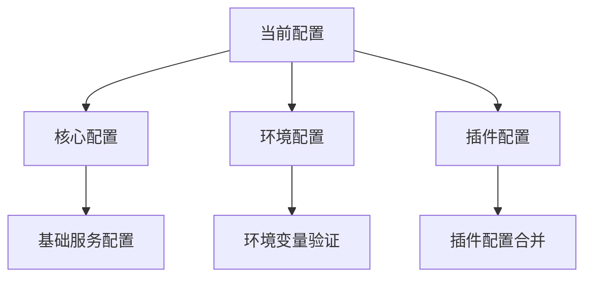
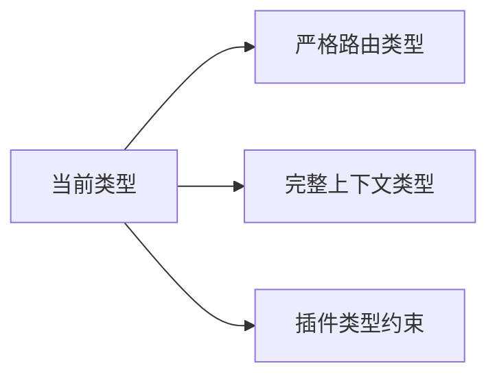
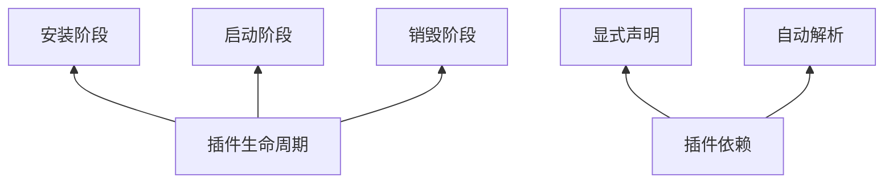
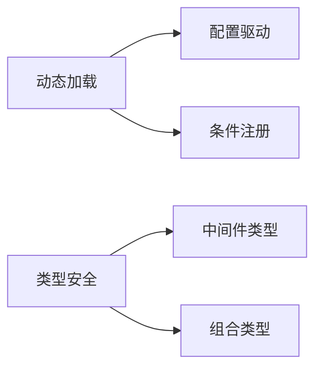

# ZeroCMF Koa 框架改进建议

## 渐进式架构优化计划

### 第一阶段：配置系统优化 (1-2天)

**实施步骤：**

## TODO
- [x] 创建config/core.ts
- [x] 创建config/env.ts 
- [x] 创建config/plugin.ts
- [x] 修改config/app.ts
- [x] 添加环境变量验证
- [ ] 实现配置热更新 (暂不实现，使用pm2管理)

1. 创建分层配置结构：
   - `config/core.ts` - 基础不可变配置
   - `config/env.ts` - 环境相关配置
   - `config/plugin.ts` - 插件配置合并

2. 修改`config/app.ts`整合新系统：
   - 保持现有`createAppConfig()`接口不变
   - 内部实现改用分层配置
   - 添加环境变量验证

3. 验证指标：
   - 现有功能不受影响
   - 配置热更新测试
   - 环境变量覆盖测试

### 第二阶段：类型系统增强 (2-3天)

**实施步骤：**

## TODO
- [x] 定义路由Handler类型
- [x] 完善Context类型
- [ ] 添加插件生命周期类型
- [ ] 验证类型覆盖率

1. 增强`src/cmf/typings`：
   - 定义严格路由Handler类型
   - 完善Context类型扩展
   - 添加插件生命周期类型

2. 验证指标：
   - 类型覆盖率提升
   - 编译时错误检测
   - 自动补全增强

### 第三阶段：插件系统改造 (3-5天)

**实施步骤：**

## TODO  
- [x] 实现生命周期管理
- [x] 添加依赖声明机制
- [x] 支持配置注入
- [ ] 测试插件兼容性

1. 改造`plugins/index.ts`：
   - 实现插件生命周期管理
   - 添加依赖声明机制
   - 支持配置注入

2. 验证指标：
   - 现有插件兼容性
   - 依赖解析测试
   - 生命周期钩子测试

### 第四阶段：中间件优化 (2-3天)

**实施步骤：**

## TODO
- [x] 实现动态加载
- [x] 添加配置支持
- [x] 增强类型定义
- [ ] 性能基准测试

1. 改造`middlewares/index.ts`：
   - 实现动态加载机制
   - 添加配置支持
   - 增强类型定义

2. 验证指标：
   - 性能基准测试
   - 类型安全检查
   - 配置覆盖测试

## 技术栈优化
[保留原有技术栈优化内容...]

## 函数式架构优化方案
[保留原有函数式优化内容...]

## 性能优化
[保留原有性能优化内容...]

## 安全增强
[保留原有安全增强内容...]

## 开发体验
[保留原有开发体验内容...]

## 可观测性
[保留原有可观测性内容...]

## 文档完善
[保留原有文档完善内容...]
