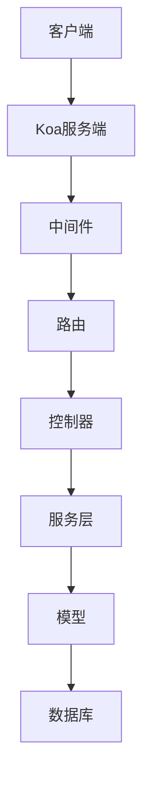

# ZeroCMF-Koa 内容管理框架


ZeroCMF-Koa 是一个基于 Koa.js 和 TypeScript 构建的现代化内容管理框架(CMF)后端系统，提供完整的API解决方案和内置的管理系统。

## ✨ 功能特性

- **完整的管理系统**: 用户、角色、菜单、部门管理
- **现代技术栈**: Koa、TypeScript、Prisma ORM
- **RBAC权限控制**: JWT认证 + Casbin授权
- **可扩展插件系统**: 轻松添加新功能
- **API文档**: 自动生成的Swagger文档
- **多数据库支持**: MySQL、PostgreSQL、SQLite
- **云原生支持**: 支持无服务器部署

## 📦 安装指南

```bash
# 安装依赖
npm install

# 初始化数据库(先配置.env文件)
npx prisma migrate dev --name init
```

## ⚙️ 配置说明

创建`.env`文件并配置数据库连接:

```bash
DATABASE_URL="mysql://用户名:密码@localhost:3306/数据库名"
```

## 🚀 快速开始

```bash
# 开发模式
npm run dev

# 生产环境构建
npm run build
```

## 🌟 核心架构



## 🗂 目录结构

```
src/
├── cmf/          # 核心框架
├── config/       # 配置文件
├── plugins/      # 插件系统
├── typings/      # 类型定义
└── index.ts      # 主入口
```

## 🛠 管理功能

- 用户与角色管理
- 菜单与权限控制
- 部门与岗位管理
- 媒体库管理
- 系统日志监控

## 🔌 插件示例(文章模块)

```typescript
// 插件目录结构示例
plugins/
└── article/
    ├── controller/
    ├── models/
    ├── router/
    └── service/
```

## ☁️ 部署方案

### 本地部署

```bash
npm run build
npm start
```

### 无服务器部署(阿里云FC)

```bash
npm run build
s deploy
```

## 📚 相关文档

- [开发指南](./docs/development.md)
- [API参考](./docs/api.md)
- [插件开发](./docs/plugins.md)

## 🔗 在线演示

演示地址: [CMS示例后台](https://demo.zerocmf.com/admin)

- 演示账号: demo / demo

---

🎯 **环境要求**

- Node.js 18.15+
- MySQL 8.0+
- 推荐使用 PNPM 7.18+
